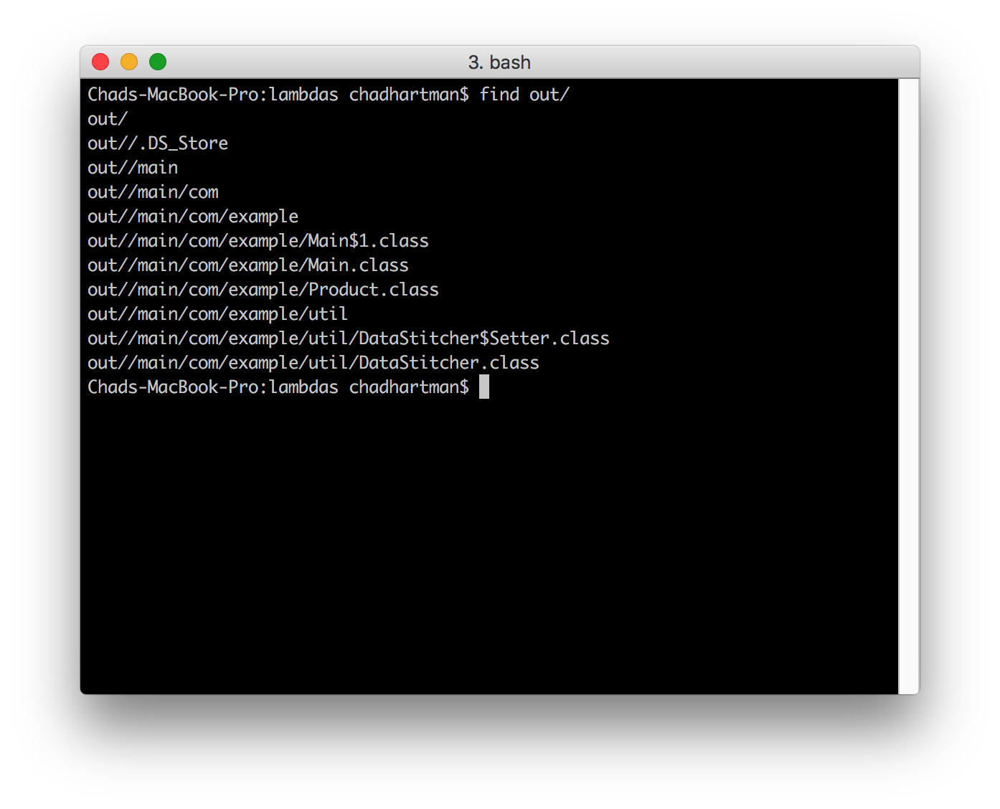
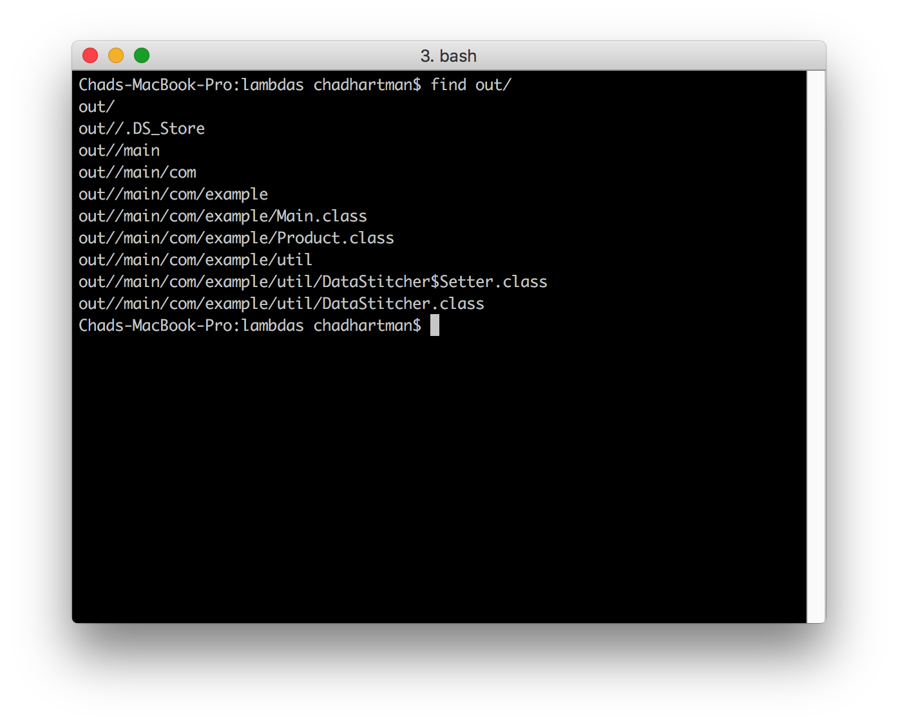
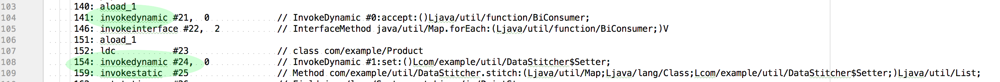
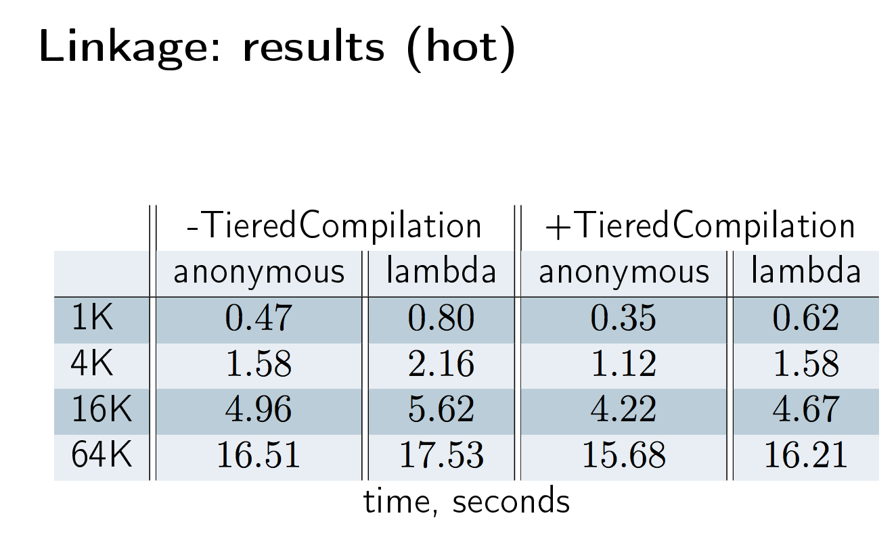
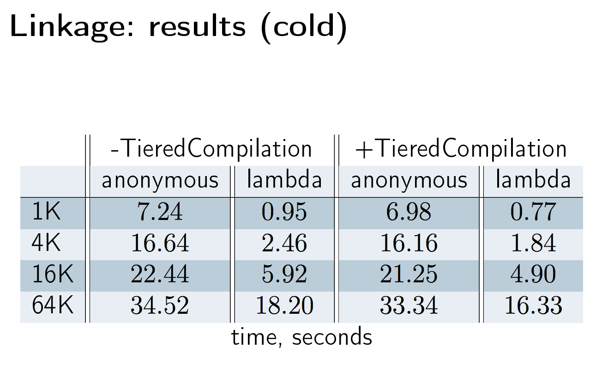
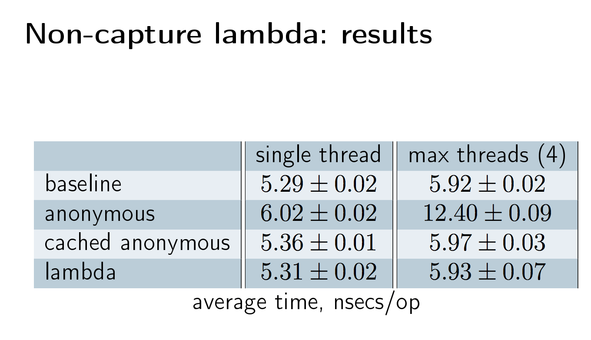
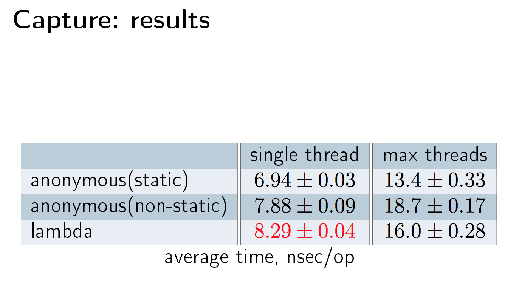

## Example

```java
Map<String, String[]> properties = new HashMap<>();
properties.put(KEY_ID, new String[] { "1", "2", "3", "4" });
properties.put(KEY_CATEGORY, new String[] { "clothes", "accessories", "accessories", "clothes" });
properties.put(KEY_QUANTITY, new String[] { "2", "1", "1", "4" });
properties.put(KEY_PRICE, new String[] { "9.99", "49.99", "39.99", "19.99" });

properties.forEach((property, values) -> {
	System.out.println(property + ":" + Arrays.toString(values));
});
```

## Custom Example

```java
@FunctionalInterface
public interface Setter<T> {
	void set(T item, String property, String value);
	// void set(List<T> items, String property, String[] values); // Additional Methods result in errors
}
```

## ByteCode Inspection

### Traditional




### Lambda




### Analysis

* `invokedynamic`
    * Introduced with Java 7
    * Translates at runtime
    * Creates a lambda factory which returns instances
    * Convert the body of the lambda expression into a method
        * Capturing
            * The lambda accesses variables defined outside its body
            * Prepend the arguments of the lambda expression with an additional argument for each of the captured variables
            * Explanation for "effectively final"
        * Non-Capturing
            * the lambda doesn’t access any variables defined outside its body
## Performance

### Anonymous Classes vs Lambda

JIT Compiler

> In practice, methods are not compiled the first time they are called. For each method, the JVM maintains an invocation count, which starts at a predefined compilation threshold value and is decremented every time the method is called. When the invocation count reaches zero, a just-in-time compilation for the method is triggered. Therefore, often-used methods are compiled soon after the JVM has started, and less-used methods are compiled much later, or not at all. The JIT compilation threshold helps the JVM start quickly and still have improved performance. The threshold value was selected to obtain an optimal balance between startup times and long-term performance.

> The JIT compiler can compile a method at different optimization levels: cold, warm, hot, veryHot, or scorching. Higher optimization levels are expected to provide better performance, but they also have a higher compilation cost in terms of CPU and memory.





### Capture vs Non Capture Lambda




    
## Sources

* https://www.infoq.com/articles/Java-8-Lambdas-A-Peek-Under-the-Hood
* https://www.ibm.com/support/knowledgecenter/en/SSYKE2_9.0.0/com.ibm.java.vm.9.0.doc/docs/jit_overview.html
* http://www.oracle.com/technetwork/java/jvmls2013kuksen-2014088.pdf