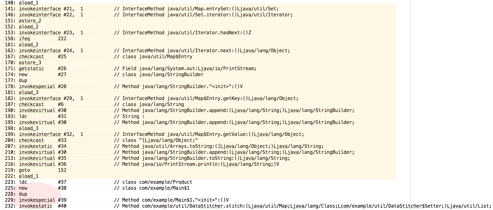

## Example

```java
Map<String, String[]> properties = new HashMap<>();
properties.put(KEY_ID, new String[] { "1", "2", "3", "4" });
properties.put(KEY_CATEGORY, new String[] { "clothes", "accessories", "accessories", "clothes" });
properties.put(KEY_QUANTITY, new String[] { "2", "1", "1", "4" });
properties.put(KEY_PRICE, new String[] { "9.99", "49.99", "39.99", "19.99" });
properties.forEach((property, values) -> {
	System.out.println(property + ":" + Arrays.toString(values));
});
```

## Custom Example

```java
@FunctionalInterface
public interface Setter<T> {
	void set(T item, String property, String value);
	// void set(List<T> items, String property, String[] values); // Additional Methods result in errors
}
```

## ByteCode Inspection

### Traditional




### Lambda


### Analysis

* `invokedynamic`
    * Introduced with Java 7
    * Translates at runtime
    * Creates a lambda factory which returns instances
    * Convert the body of the lambda expression into a method
        *Capturing
            * The lambda accesses variables defined outside its body
            * Prepend the arguments of the lambda expression with an additional argument for each of the captured variables
            * Explanation for "effectively final"
        * Non-Capturing
            * the lambda doesn’t access any variables defined outside its body
## Performance
* Linkage
    
## Sources: 

* https://www.infoq.com/articles/Java-8-Lambdas-A-Peek-Under-the-Hood
* http://www.oracle.com/technetwork/java/jvmls2013kuksen-2014088.pdf